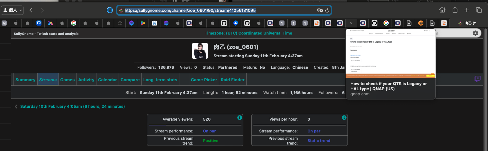

# Twitch VOD 下載
###### version: `1.0`
---
## google colab版本(好用的免費線上網站)
 網址: [點擊](https://colab.research.google.com/drive/1S2b_TpgtXJUIUsn2try9QI_mrR7LE5pP?usp=sharing)
 
 最近想要下載實況主音檔所製作的 下載的程式跟原本的不同 不能挑選時間軸 也不會再更新除錯等等的 

 Source_Code:
 ```python
# mount google drive
from google.colab import drive
drive.flush_and_unmount()
from google.colab import drive
drive.mount('/content/drive')
import os
path = "/content/drive/MyDrive/twitchVOD"
if not os.path.isdir(path):
  os.makedirs(path)

# Install Packages
!pip install aiohttp # asynchronous HTTP requests
!pip install cloudscraper #  Cloudflare's anti-bot measures
!pip install nest_asyncio # nesting asyncio event loops, useful in Jupyter Notebook environment
!apt install ffmpeg
 ```

 ```python
 # @title #主程式 { display-mode: "form" }
# @markdown #輸入範例:
# @markdown https://twitchtracker.com/guanweiboy/streams/40501172231
# @markdown ---
# @markdown https://sullygnome.com/channel/guanweiboy/stream/40501172231
# @markdown ---
# @markdown https://streamscharts.com/channels/guanweiboy/streams/40501172231/2023-08-03 09:02
# @markdown ---

# @markdown ----
import datetime
import hashlib
import asyncio
import time
import os
from aiohttp import ClientSession
from bs4 import BeautifulSoup
import cloudscraper
import nest_asyncio

nest_asyncio.apply()

domains = [
  "https://vod-secure.twitch.tv/",
  "https://vod-metro.twitch.tv/",
  "https://vod-pop-secure.twitch.tv/",
  "https://d2e2de1etea730.cloudfront.net/",
  "https://dqrpb9wgowsf5.cloudfront.net/",
  "https://ds0h3roq6wcgc.cloudfront.net/",
  "https://d2nvs31859zcd8.cloudfront.net/",
  "https://d2aba1wr3818hz.cloudfront.net/",
  "https://d3c27h4odz752x.cloudfront.net/",
  "https://dgeft87wbj63p.cloudfront.net/",
  "https://d1m7jfoe9zdc1j.cloudfront.net/",
  "https://d3vd9lfkzbru3h.cloudfront.net/",
  "https://d2vjef5jvl6bfs.cloudfront.net/",
  "https://d1ymi26ma8va5x.cloudfront.net/",
  "https://d1mhjrowxxagfy.cloudfront.net/",
  "https://ddacn6pr5v0tl.cloudfront.net/",
  "https://d3aqoihi2n8ty8.cloudfront.net/",
]

valid_url_list = []

async def valid_main(url_list):
  links = url_list
  async with ClientSession() as session:
    tasks = [asyncio.create_task(fetch(link, session)) for link in links]
    await asyncio.gather(*tasks)

async def fetch(link, session):
  async with session.get(link) as response:
    await response.text()
    if response.status == 200:
      valid_url_list.append(link)

def get_valid_url(url_list):
  start_time = time.time()
  loop = asyncio.get_event_loop()
  loop.run_until_complete(valid_main(url_list))

def get_all_urls(streamer, vod_id, timestamp):
  vod_url_list = []
  for seconds in range(60):
    epoch_timestamp = (
      (datetime.datetime.strptime(timestamp, "%Y-%m-%d %H:%M:%S") + datetime.timedelta(seconds=seconds))
      - datetime.datetime(1970, 1, 1)
    ).total_seconds()
    base_url = streamer + "_" + vod_id + "_" + str(int(epoch_timestamp))
    hashed_base_url = str(hashlib.sha1(base_url.encode("utf-8")).hexdigest())[:20]
    for domain in domains:
      vod_url_list.append(
        domain + hashed_base_url + "_" + base_url + "/chunked/index-dvr.m3u8"
      )
  return vod_url_list

def parse_datetime_twitchtracker(tracker_url):
  scraper = cloudscraper.create_scraper(
    browser={"browser": "chrome", "platform": "windows", "desktop": True}
  )
  response = scraper.get(tracker_url)
  bs = BeautifulSoup(response.content, "html.parser")
  twitchtracker_datetime = bs.find_all(
    "div", {"class": "stream-timestamp-dt to-dowdatetime"}
  )[0].text
  soup = BeautifulSoup(response.text, "html.parser")
  print(response)
  print(twitchtracker_datetime)
  return twitchtracker_datetime

def parse_datetime_sullygnome(tracker_url):
  scraper = cloudscraper.create_scraper(
    browser={"browser": "chrome", "platform": "windows", "desktop": True}
  )
  response = scraper.get(tracker_url)
  bs = BeautifulSoup(response.content, "html.parser")
  stream_date = bs.find_all("div", {"class": "MiddleSubHeaderItemValue"})[6].text
  if len(stream_date.split(" ")[1]) > 3:
    day = stream_date.split(" ")[1][:2]
  else:
    day = stream_date.split(" ")[1][:1]
  print(stream_date.split(" "))
  month = stream_date.split(" ")[2]
  year = datetime.datetime.today().year
  timestamp = stream_date.split(" ")[3]
  stream_datetime = day + " " + month + " " + str(year) + " " + timestamp
  sullygnome_datetime = datetime.datetime.strftime(
    datetime.datetime.strptime(stream_datetime, "%d %B %Y %I:%M%p"),
    "%Y-%m-%d %H:%M:%S",
  )
  print(response)
  print(sullygnome_datetime)
  return sullygnome_datetime

def vod_recover(streamer, vod_id, timestamp):
  url_list = get_valid_url(get_all_urls(streamer, vod_id, timestamp))
  if len(valid_url_list) > 0:
    print(valid_url_list)
  else:
    print("No found")

def website_vod_recover(tracker_url):
  if "streamscharts" in tracker_url:
    streamer = tracker_url.split("channels/", 1)[1].split("/")[0]
    vod_id = tracker_url.split("streams/", 1)[1].split("/")[0]
    vod_time = tracker_url.split("/")[-1] + ":00"
    vod_recover(streamer, vod_id, vod_time)
  elif "twitchtracker" in tracker_url:
    streamer = tracker_url.split("com/", 1)[1].split("/")[0]
    vod_id = tracker_url.split("streams/", 1)[1]
    vod_recover(streamer, vod_id, parse_datetime_twitchtracker(tracker_url))
  elif "sullygnome" in tracker_url:
    streamer = tracker_url.split("channel/", 1)[1].split("/")[0]
    vod_id = tracker_url.split("stream/", 1)[1]
    vod_recover(streamer, vod_id, parse_datetime_sullygnome(tracker_url))
  else:
    return
  return streamer,vod_id


url = "https://sullygnome.com/channel/zoe_0601/90/stream/41056131095" #@param {type:"string"}
video_format = "mp3" # @param ["mp3", "mp4", "mkv", "ts"]
streamer,vod_id=website_vod_recover(url)
if video_format == "mp3":
  command_to_execute = "ffmpeg -y -i \"{}\"  /content/drive/MyDrive/twitchVOD/{}.{}".format(valid_url_list[0],streamer+"_"+vod_id,video_format)
else:
  command_to_execute = "ffmpeg -y -i \"{}\" -codec copy /content/drive/MyDrive/twitchVOD/{}.{}".format(valid_url_list[0],streamer+"_"+vod_id,video_format)
print("執行 {}".format(command_to_execute))
!eval $command_to_execute
 ```
 
 #### 優點
 - 能夠線上載不會用到本身的電腦資源(一個網頁分頁資源)
 - 能直接在google drive觀看或聆聽 
 - 因為有可能會被版權消音可以在實況 =="當下"== 先載音檔對剪輯師應該是很有幫助的 不過如果實況主使用音軌分離的話還是聽不到完整的內容
 #### 缺點
 - 以我原本的網速影片mp4下載比原本的慢蠻多的  雖然colab測速很快但感覺有被限制 所以我是只有拿來載音檔
 
 使用方法在下面 [詳細說明](#google-colab版)
 
---

## 使用說明
這個下載器不能下載太久以前的VOD大概一個月所有前的都不能 不過能夠下載到被隱藏或是訂閱才能看到的VOD
原理大概是Twitch的VOD不會馬上在他們的伺服器刪除所以可以下載到(不知道為甚麼他們沒有阻擋 所以可能有一天會失效) 有興趣的可以到下面參考資料看看 主要的程式也是借助他們的想法完成的 

---

## 使用方法

輸入的網址必須是要在[twitchtracker](https://twitchtracker.com/), [streamscharts](https://streamscharts.com/), [sullygnome](https://sullygnome.com/) 來找 我比較喜歡用twitchtracker(目前sullygnome這個網站比較正確)

找到要下載的VOD 複製上方連結 https://twitchtracker.com/guanweiboy/streams/39837398791

依照sullygnome為例選擇實況主->Stream點選後上方url即是


---
### google colab版

##### 每次開啟都要先點擊紅框下載跟連接基本的設定並等待他跑完


##### 在橘框先設定好網址跟輸出格式再點擊紅框執行下載 

##### 如果紅框沒有再跑或出現打勾完成就下載好了 檔案會在google雲端的twitchVOD資料夾裡 中途停止也會有檔案


- 網址格式跟上面之前的一樣
- 如果沒有重開就不用再去基本設定重按
- 如果輸入三個網站的網址VOD都還是載不了的話 我大概也沒有辦法 希望不要再寄信給我

---
## 已知問題

有任何問題可以寄信或是在這個筆記留言 我看到會想辦法解決

:::spoiler v1.0問題
- ~~m3u8檔案好像不會重製 如果發現實況結束時間有問題 請手動去m3u8資料夾裡刪除要下載VOD的m3u8檔案~~
- v1.0 因為twitchtracker網頁有更新所以不能用了
:::

:::spoiler {state="open"} 最新問題
- twitchtracker網頁有時候會搞鬼不給資訊 所以可以多用sullygnome來查 用法也是去找VOD的網頁網址(~~streamscharts目前也不能~~) ex輸入網址: https://sullygnome.com/channel/guanweiboy/stream/39850938071
- 如果實況主短時間內重開實況 會只有前一段的VOD 重開後的會沒有 因為twitchtracker sullygnome不會分開紀錄 但streamscharts會 所以暫時解決方法更新再v1.2

- 太長的VOD不分段下載可能會有問題 還不確定多久 可能8小時以上 建議就用分段或下載單自訂時間分段下載

- 程式如果下載到一半中斷或有錯會導致在目錄中的temp資料夾不會被刪除 留下大量ts小片段影片檔 不過應該是不會有甚麼問題 如果有錯可以手動刪除整個資料夾
- 有時候 twitchtracker sullygnome 這兩個網站會給錯誤時間 所以可以使用 streamscharts 來下載
- 目前twitch官方好像有改他們VOD的儲存 如果是被實況主親自刪除的VOD會找不到 但是隱藏的VOD是可以的

---

## 參考資料

- https://github.com/ItIckeYd/VodRecovery
- https://github.com/TwitchRecover/TwitchRecover
- https://hackmd.io/@jEWnt9JdSPq2TCzOn1qO3Q/HkrRmRirs#

---

## 免責聲明

==VOD 下載== is not associated with Amazon, Twitch, Twitch Tracker, Sullygnome, Streamscharts or any of their partners and parent companies. All copyrights belong to their respective owners.

來自: https://github.com/TwitchRecover/TwitchRecover